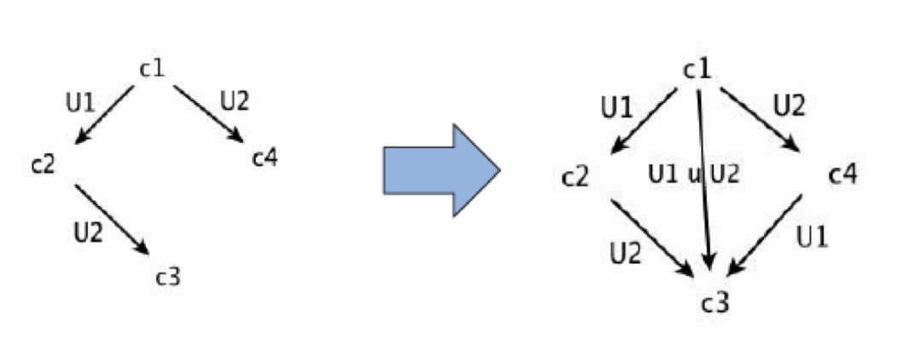
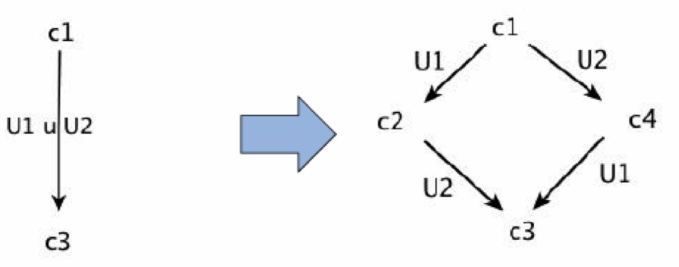

# Reti di Petri

### Cosa è una rete?
`N=(B,E,F)` è una rete elementare avendo:
- `B` insieme delle condizioni (booleane)
- `E` insieme degli eventi
- `F` relazione di flusso, `F ⊆ (B x E) ∪ (E x B)`

- Non esistono eventi e condizioni isolati
- `Ran(F) ∪ Dom(F) = B ∪ E`
- `B ∩ E = ∅ e B ∪ E ≠ ∅`

### Sistema elementare?
Data una rete `N=(B,E,F)` si defisce sistema elementare `S=(N, cᵢₙ)`, in esteso `S=(B,E,F,cᵢₙ)`, con `cᵢₙ ∈ B` caso iniziale (insieme di condizioni vere).


### Rete di occorrenze e a che cosa servono
Presa una rete `N=(B,E,F)` si defisce **rete di occorrenze** sse:
- `∀ b ∈ B |*b| ≤ 1`, avendo conflitti solo in avanti
- `∀ x,y ∈ B ∪ E` se ho `(x,y) ∈ F^+` non ho `(y,x) ∈ F^+`
- `∀ e ∈ E : {x ∈ B ∪ E | xF\*e}` è finito
- `∀ x,y ∈ B ∪ E` la relazione di conflitto `x#y` non è riflessiva

Dove `# ⊆ X x X` è tale che:
`x#y` sse esistono `e1,e2 ∈ E` tali che `*e1 ∩ *e2 ≠ ∅ AND e1 ≤ x AND e2 ≤ y`

Le reti di occorrenze servono a costruire un processo ramificato di un sistema 
elementare ovvero un "oggetto" che rappresenta le possibili esecuzioni di un
sistema elementare.

### Cosa è un processo non sequenziale
Data la rete `N=(B,E,F)` e dato il sistema elementare `σ=(S,T,F,cᵢₙ)` 
si ha che un **processo non sequenziale** è la coppia `(N, ϕ)`, con `ϕ` che mappa dalla 
rete al sistema, tale che:
- `N` è una _rete causale_
- `ϕ : B ∪ E -> S ∪ T` tale che:
  - `ϕ(B) ⊆ S`, `ϕ(E) ⊆ T`
  - `∀ x,y in B ∪ E` se `ϕ(x) = ϕ(y)` allora `x ≤ y OR y ≤ x`
  - `∀ e in E ϕ(*e) = *ϕ(e) AND ϕ(e*) = ϕ(e)*`
  - `ϕ(MIN(N)) = cᵢₙ`, avendo `MIN(N)={x ∈ B ∪ E| ¬∃y t.c. (y,x) ∈ F}`

### Cosa è un processo ramificato
Data la rete `N=(B,E,F)` e dato il sistema elementare `σ=(S,T,F,cᵢₙ)` 
si ha che un **processo ramificato** è la coppia `(N, ϕ)`, con `ϕ` che mappa dalla 
rete al sistema, tale che:
- `N` è una _rete di occorrenze_
- `ϕ : B ∪ E -> S ∪ T` tale che:
  - `ϕ(B) ⊆ S`, `ϕ (E) ⊆ T`
  - `∀ e1,e2 ∈ E` se `*e1 = *e2 AND ϕ(e1) = ϕ(e2)` allora `e1=e2`
  - `∀ e ∈ E ϕ(*e) = *ϕ(e) AND ϕ(e*) = ϕ(e)*`
  - `ϕ (MIN(N)) = cᵢₙ`, avendo `MIN(N)={x ∈ B ∪ E| ¬∃y t.c. (y,x) ∈ F}`

### Quando possiamo parlare di transizioni concorrenti, eventi concorrenti nelle reti di petri)
Possiamo dire che due eventi `e1,e2 ∈ E` (diversi tra loro) sono concorrenti sse
```
(*e1 ∪ e1*) ∩ (*e2 ∪ e2*) = ∅
```
ovvero posso avere `{e1,e2}` come _passo abilitato_ in un certo caso raggiungibile.


### Taglio in una rete
Un taglio è un **co-set massimale**.

`C` viene definito _co-set massimale_ sse, con `X = B ∪ E`:
```
∀y ∈ X and y ¬∈ C 

∃ c ∈ C : y ¬co c
```

### Linea in una rete
Una linea è un **li-set massimale**.

`C` viene definito _li-set massimale_ sse, con `X = B ∪ E`:
```
∀y ∈ X and y ¬∈ C 

∃ c ∈ C : y ¬li c
```

### Cos'è un insieme massimale
`C` viene definito _insieme massimale_ sse, con 
- X insieme
- R relazione binaria
```
∀y ∈ X and y ¬∈ C 

∃ c ∈ C : y ¬R c
```

### Insieme Parzialmente ordinato
Un insieme parzialmente ordinato è una coppia formata da un insieme e da una relazione
d'ordine. Nel nostro caso ci interessa la relazione d'ordine data dalla relazione di 
causalità tra elementi di una rete avendo, con X = B ∪ E: (X, ≤) = (B ∪ E, F^*)
si ha quindi che è:
- riflessiva
- antisimmetrica
- transitiva

### Regola di Scatto
dato un caso c ∈ C_σ e dato un evento e ∈ E si ha che e è abilitato in c,
scrivendolo c[e> sse:
*e ⊆ c AND e* ∩ c = ∅
in questo caso lo scatto di e porta in un nuovo caso c', avendo c[e>c', con:
c' = (c - *e) ∪ e*

### Confusione e Conflitto
Dati e1,e2 ∈ E si ha che essi sono in conflitto in un caso raggiungibile c ∈ C_σ 
si ha che essi sono in conflitto sse:
c[e1> AND c[e2> AND ¬c[{e1,e2}>
e si possono avere due tipi di conflitti:
- forward
- backward

Definiamo confusione una situazione fondamentale della rete ottenuta con l'unione di
conflitti e concorrenza. Si hanno due tipi di confusione, dati dalla forma della rete:
- confusione asimmetrica
- confusione simmetrica


### Eventi concorrenti
Sia `N = (B, E, F)` una rete elementare e `U ⊆ E`.

`U` è un insieme di eventi indipendenti sse
```
∀ e1, e2 in U: (*e1 ∪ e1*) ∩ (e2* ∪ e2*)=∅ 
```

### Diamond property
Dati U1, U2 ∈ U_σ tali che:
- `U1 ∩ U2 = ∅`
- `U1 ≠ ∅`
- `U2 ≠ ∅`

allora un grafo dei casi raggiungibili del tipo 


##### prova 1

Per semplicità assumiamo U1 = e1 e U2 = e2. In c1 ho che sia e1 che e2 sono 
abilitati, avendo quindi che c[e1>c2 e c[e2>c4. D'altro canto sappiamo anche 
che c2[e2>c3. Avendo c[e1>c2 e c[e2>c4 posso dire che:
- `*e1 ∩ e2* = ∅`
- `*e2 ∩ e1* = ∅`
in quanto se sono entrambi abilitati le loro pre sono vere e le loro post false ma
potendo scattare entrambi sicuramente le pre di uno non derivano dalle post dell'altro. 
Inoltre avendo che c[e1>c2 e c2[e2>c3 posso dire che:
- `e1* ∩ e2* = ∅`
- `*e1 ∩ *e2 = ∅`
in quanto se `e2` può scattare dopo `e2` di certo non condividono precondizioni d'altro canto
dopo lo scatto di `e1` le sue post sono vere ma dato che `e2` può ancora scattare le sue psot sono false.
Quindi pre e post di `e1` ed `e2` sono disgiunte. Si è quindi dimostrato che sono completamente
indipendenti e quindi possono scattare come passo nell'ordine che vogliono e quindi devo
aggiungere l'arco mancante.

##### prova 2

Avendo che U1 e U2 possono scattare come passo unico da c1 a c3 so che i due
sono passi abilitati quindi sono formati da eventi tra loro indipendenti. Possono
quindi scattare anche singolarmente in un ordine qualsiasi, andando a ricreare 
il grafo dei casi raggiungibili formato dall'esecuzione dei singoli passi 
in sequenza.